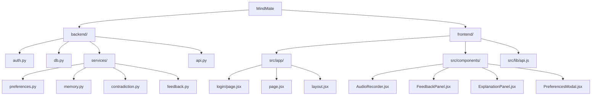

# 🧠 MindMate

**A personalized, authenticated decision-support system with memory, preferences, and feedback-driven behavior.**

MindMate helps users think clearly about decisions by combining structured user memory, configurable response styles, and transparent system behavior in a persistent, multi-user environment.

---

## 🎯 Overview

MindMate is a multi-user, authenticated application that provides decision support through a conversational interface.

Unlike generic LLM usage where each interaction is treated as stateless and ephemeral, MindMate operates as a stateful system that maintains **user-specific context** across sessions. Responses are shaped by stored preferences, structured memory, and explicit feedback, resulting in outputs that are more consistent, personalized, and interpretable over time.

### Key Characteristics:
*   **User-scoped personalization** (tone, preferences, memory)
*   **Persistent context** across sessions
*   **Deterministic behavior control**
*   **Feedback-aware response adaptation**
*   **Explainability and observability** into system decisions

---

## 🏗️ Architecture

```mermaid
flowchart LR
    F[Frontend<br/>(Next.js)]
    B[Backend<br/>(FastAPI)]
    L[LLM Provider<br/>(Groq API)]
    S[(Supabase<br/>Auth & DB)]

    F -->|HTTPS| B
    B -->|Prompt| L
    L -->|Response| B
    B --> F
    B --> S
```

### Key Architectural Choices
*   **Authentication-first design** using Supabase Auth and JWT verification.
*   **User-scoped data isolation** for preferences, memory, and feedback.
*   **Policy-driven prompt construction** layered over an LLM API.
*   **Deterministic control logic** for tone selection, memory retrieval, and feedback handling.

---

## 🧩 Core Capabilities

### 1. Authentication & Multi-User Isolation
*   Users authenticate via **Supabase** (email/password).
*   **JWTs** are verified on every backend request.
*   Preferences, memory, and feedback are strictly scoped per user.
*   Sessions persist securely across refreshes and devices.

### 2. Preference-Aware Responses
Users can explicitly control how MindMate responds:
*   ✨ **Clean**: Professional and balanced.
*   💬 **Casual**: Relaxed and conversational.
*   🎯 **Blunt**: Direct and no-nonsense.
*   🔥 **Unfiltered**: Raw and explicit (opt-in).

Response styles are enforced through deterministic prompt constraints.

### 3. Structured Memory
MindMate stores structured summaries rather than raw conversation logs, enabling reliable personalization without uncontrolled drift.
*   **Preference memory**: Tone, risk tolerance context.
*   **Pattern memory**: Recurring user behaviors (e.g., overthinking).
*   **Outcome memory**: What advice worked in the past.

### 4. Feedback-Driven Adaptation
Users can provide optional feedback on:
*   Usefulness (1-10)
*   Tone alignment
*   Outcome effectiveness

Feedback is aggregated and verified before influencing future system behavior.

### 5. Explainability & Observability
In **Development Mode**, MindMate exposes internal metadata:
*   Tone mode used
*   Memory labels applied
*   Confidence estimates

This improves debugging and trust without exposing internal details to end users.

---

## 📁 Project Structure



---

## 🚀 Setup Instructions

### Prerequisites
*   Node.js 18+
*   Python 3.9+
*   Supabase account (free tier)

### Backend Setup
```bash
cd backend
python -m venv venv
source venv/bin/activate  # or venv\Scripts\activate on Windows
pip install -r requirements.txt
uvicorn api:app --reload --port 8000
```
Backend runs at: `http://localhost:8000`  
API docs: `http://localhost:8000/docs`

### Frontend Setup
```bash
cd frontend
npm install
npm run dev
```
Frontend runs at: `http://localhost:3000`

---

## 📦 Deployment

MindMate is cloud-ready and deployed on:
*   **Frontend**: Vercel
*   **Backend**: Render
*   **Auth & Database**: Supabase

### Environment Variables
Ensure the following variables are set in your deployment environment:
*   `NEXT_PUBLIC_API_URL`
*   `NEXT_PUBLIC_SUPABASE_URL`
*   `NEXT_PUBLIC_SUPABASE_ANON_KEY`
*   `SUPABASE_SERVICE_ROLE_KEY` (Backend only)
*   `GROQ_API_KEY` (Backend only)

---

## 🧑‍⚖️ Design Philosophy
*   **Stability** > Intelligence
*   **Determinism** > Autonomy
*   **Explainability** > Cleverness

MindMate is designed to remain reliable, debuggable, and predictable as a decision-support system.

---

## 📄 License
MIT License.

## 🙏 Credits
Built with **FastAPI**, **Next.js**, **Supabase**, and **Tailwind CSS**.
