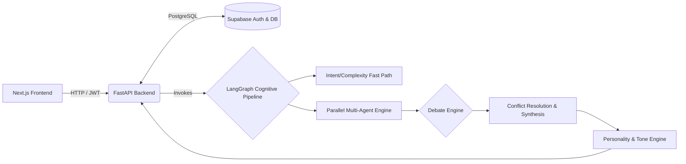

# 🧠 MindMate

A futuristic, multi-agent cognitive architecture powered by **LangGraph**, **FastAPI**, **Next.js**, and **Supabase**.

**"A private board of AI directors helping you think clearly."**

---

## 🎯 Overview

MindMate is not a standard chatbot wrapper. It is a simulated "Council of Minds." When presented with complex dilemmas, it runs multiple specialized cognitive agents simultaneously, identifies disagreements, facilitates a debate, and synthesizes a single, highly nuanced resolution.

The council consists of five specialized minds:
- **Ethical Agent**: Focuses on moral duty and principles of right action.
- **Analytical Agent (Risk & Logic)**: Focuses on logic, practical outcomes, and risk assessment.
- **Emotional Agent (EQ)**: Focuses on emotional attunement, relationships, and empathy.
- **Values Agent**: Focuses on identity, legacy, and long-term personal alignment.
- **Red Team Agent**: Plays devil's advocate, fiercely challenging assumptions.

---

## 🏗️ Architecture


```mermaid
graph LR
    A[Next.js Frontend] -->|HTTP / JWT| B(FastAPI Backend)
    B <-->|PostgreSQL| C[(Supabase Auth & DB)]
    B -->|Invokes| D{LangGraph Cognitive Pipeline}
    D --> E[Intent/Complexity Fast Path]
    D --> F[Parallel Multi-Agent Engine]
    F --> G{Debate Engine}
    G --> H[Conflict Resolution & Synthesis]
    H --> I[Personality & Tone Engine]
    I --> B
```

### Tech Stack
- **Frontend**: Next.js 14 (App Router), React, Tailwind CSS, Framer Motion.
- **Backend**: FastAPI, Pydantic, Groq API (ultra-fast Llama inference).
- **Core Intelligence**: LangGraph orchestrating concurrent agents, debate thresholds, and state management.
- **Database & Auth**: Supabase (PostgreSQL) for JWT auth, session management, and persistent conversation memory.

---

## 🧠 How The Cognitive Pipeline Works

The intelligence of MindMate is defined by a deeply structured `StateGraph` in the backend:

1. **Classification & Fast Path**: Queries are instantly classified by intent and complexity. Simple greetings ("hi") or casual chat take a "Fast Path", bypassing the heavy agent machinery to return responses in under a second.
2. **Parallel Agent Reasoning**: For medium/complex queries, the selected agents (weighted by the user) scale up automatically using concurrent threads, analyzing the problem from their unique vantage points simultaneously.
3. **Adaptive Debate Phase**: The system calculates a *Disagreement Score* across the agent outputs. If the score exceeds the configurable threshold (`0.15`), a dynamic debate round is triggered where a moderator LLM identifies logical gaps and pushes the agents to reconcile.
4. **Resolution & Personality**: A conflict resolution node synthesizes the final answer according to the user's defined "Brain Weights" (sliders). Finally, a dual-layer Personality Engine applies the user's chosen Tone Mode (*Clean, Casual, Blunt, or Unfiltered*).

---

## 📁 Project Structure

```text
MindMate/
├── backend/
│   ├── app/
│   │   ├── api.py                  # FastAPI Application Factory
│   │   ├── routers/                # API Endpoints (chat, auth, trace)
│   │   ├── models/                 # Pydantic Schemas (ChatResponse, BrainConfig)
│   │   ├── services/               # Personality, Memory (Supabase), Conflict Resolution
│   │   └── langgraph/              # The Cognitive Pipeline
│   │       ├── workflow.py         # Main StateGraph definition
│   │       ├── agents.py           # Parallel agent execution engine
│   │       └── orchestrator.py     # Fast-path and routing logic
│   ├── requirements.txt            
│   └── .env                        # Groq & Supabase credentials
│
└── frontend/
    ├── src/
    │   ├── app/                    # Next.js App Router pages (login, chat)
    │   ├── components/             # React UI (Sidebar, ChatBubble, BrainSliders)
    │   ├── context/                # AuthContext (Supabase Session Management)
    │   └── lib/                    # API clients (api.js, supabase.js)
    ├── package.json
    └── tailwind.config.js
```

---

## 🚀 Setup Instructions

### Prerequisites
- **Python 3.10+**
- **Node.js 18+**
- **Supabase Project**: (URL and Anon/Service Keys required)
- **Groq API Key**: (For fast LLM inference)

### 1. Backend Setup

1. Navigate to the backend directory:
   ```bash
   cd backend
   ```
2. Create and activate a virtual environment:
   ```bash
   python -m venv venv
   source venv/bin/activate  # Windows: venv\Scripts\activate
   ```
3. Install dependencies:
   ```bash
   pip install -r requirements.txt
   ```
4. Configure Environment Variables (`backend/.env`):
   ```env
   GROQ_API_KEY=your_groq_key
   SUPABASE_URL=your_supabase_url
   SUPABASE_ANON_KEY=your_supabase_anon_key
   SUPABASE_SERVICE_ROLE_KEY=your_supabase_service_key
   ```
5. Run the FastAPI development server:
   ```bash
   python -m uvicorn app.main:app --host 0.0.0.0 --port 8000 --reload
   ```

### 2. Frontend Setup

1. Navigate to the frontend directory:
   ```bash
   cd frontend
   ```
2. Install dependencies:
   ```bash
   npm install
   ```
3. Configure Environment Variables (`frontend/.env.local`):
   ```env
   NEXT_PUBLIC_SUPABASE_URL=your_supabase_url
   NEXT_PUBLIC_SUPABASE_ANON_KEY=your_supabase_anon_key
   NEXT_PUBLIC_API_URL=http://localhost:8000
   ```
4. Run the development server:
   ```bash
   npm run dev
   ```

---

## 🎮 Usage

1. **Sign In**: Create an account or log in via the Supabase-powered authentication screen.
2. **Workspace**: Enter your query into the chat input. 
3. **Brain Weights**: Click the sliders icon to adjust the relative influence of the Ethical, Analytical, Emotional, Values, and Red Team agents.
4. **Tone Control**: Select your preferred output style (*Clean, Casual, Blunt, Unfiltered*).
5. **Thinking Trace**: After the AI responds, click on the "MindMate thought for X seconds" indicator to view the internal LangGraph trace, showing you exactly how the agents debated and arrived at their conclusion.

---

## 🎨 Design Features

### Visual Excellence
- **Calm Thinking Workspace**: Minimalist, distraction-free aesthetic.
- **Dynamic Blob Visualizer**: An animated, color-shifting SVG blob that subtly reflects the active AI tone and thinking state.
- **Premium Animations**: Framer Motion handles staggered lists, smooth chat bubble entries, and highly polished collapsible sidebars.

### Resiliency
- **Fail-Soft Architecture**: Fallback mechanisms ensure that even if the cognitive graph times out, a safe contextual response is still delivered.
- **Concurrent Executions**: Utilizing `ThreadPoolExecutor` ensures parallel agent generation, drastically cutting down complex query latency.

---

## 📦 Production Deployment

MindMate is designed to be deployed seamlessly to standard cloud providers.

**Backend (Render / Railway)**:
- Ensure all Supabase and Groq environment variables are configured.
- Start the app using a robust ASGI server:
  ```bash
  uvicorn app.main:app --host 0.0.0.0 --port 10000
  ```

**Frontend (Vercel / Netlify)**:
- Set `NEXT_PUBLIC_API_URL` to your production backend's URL.
- Deploy directly from the `frontend` folder using standard Next.js build settings. The `lib/api.js` client acts as a safety layer natively handling JWT token refreshes and edge-case Render sleep delays.

---

**Built with ⚡ for unparalleled clarity in decision-making.**
